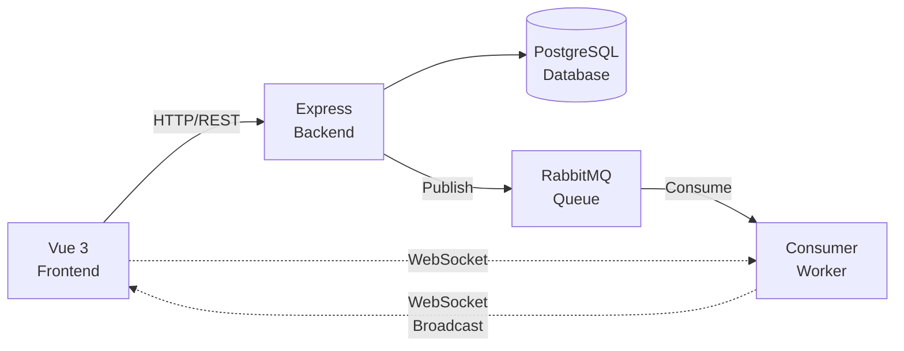

# 🔔 Sistema de Notificações em Tempo Real

Sistema completo de notificações em tempo real com painel administrativo, construído com **Node.js**, **Express**, **TypeORM**, **PostgreSQL**, **RabbitMQ**, **Socket.io** e **Vue 3**.

## 📋 Funcionalidades

### Para Usuários:

- ✅ Login e registro de usuários
- ✅ Receber notificações em tempo real via WebSocket
- ✅ Contador de notificações não lidas (sino estilo YouTube/Facebook)
- ✅ Visualização rápida das últimas 10 notificações no dropdown
- ✅ Página completa para ver todas as notificações
- ✅ Listar todas as notificações com filtro de status
- ✅ Marcar notificação individual como lida
- ✅ Marcar todas as notificações como lidas

### Para Administradores:

- ✅ Login fixo (admin/admin)
- ✅ Listar todos os usuários cadastrados
- ✅ Enviar notificações para usuários selecionados
- ✅ Seleção múltipla de usuários destinatários

## 🏗️ Arquitetura



### Fluxo de Notificações:

1. **Admin envia notificação** → API REST
2. **Backend salva no PostgreSQL** → Cria notification + recipients
3. **Backend publica na fila RabbitMQ** → Queue "notifications"
4. **Consumer processa a fila** → Recebe mensagens
5. **Consumer envia via WebSocket** → Para usuários conectados
6. **Frontend atualiza em tempo real** → Contador + lista de notificações

## 🗄️ Estrutura do Banco de Dados

```sql
users (
  id SERIAL PRIMARY KEY,
  username VARCHAR UNIQUE NOT NULL,
  password_hash VARCHAR NOT NULL,
  is_admin BOOLEAN DEFAULT false,
  created_at TIMESTAMP DEFAULT NOW()
)

notifications (
  id SERIAL PRIMARY KEY,
  message TEXT NOT NULL,
  created_by VARCHAR NOT NULL,
  created_at TIMESTAMP DEFAULT NOW()
)

notification_recipients (
  id SERIAL PRIMARY KEY,
  notification_id INTEGER REFERENCES notifications(id),
  user_id INTEGER REFERENCES users(id),
  read_at TIMESTAMP NULL,
  received_at TIMESTAMP DEFAULT NOW()
)
```

## 🚀 Como Executar

### Pré-requisitos

- Node.js 18+
- Docker e Docker Compose
- npm ou yarn

### 1️⃣ Subir PostgreSQL e RabbitMQ

```bash
docker-compose up -d
```

Isso irá iniciar:

- **PostgreSQL** na porta `5432`
- **RabbitMQ** na porta `5672` (AMQP)
- **RabbitMQ Management UI** em `http://localhost:15672` (guest/guest)

### 2️⃣ Configurar Backend

```bash
cd backend

# Instalar dependências
npm install

# Copiar arquivo de ambiente
cp .env.example .env

# Rodar em desenvolvimento
npm run dev
```

O backend estará rodando em `http://localhost:3000`

### 3️⃣ Configurar Frontend

```bash
cd frontend

# Instalar dependências
npm install

# Rodar em desenvolvimento
npm run dev
```

O frontend estará rodando em `http://localhost:5173`

## 🎯 Como Usar

### 1. Criar Usuários

1. Acesse `http://localhost:5173/login`
2. Clique em "Criar conta"
3. Crie 2-3 usuários de teste (ex: `user1`, `user2`, `user3`)

### 2. Fazer Login como Admin

1. Acesse `http://localhost:5173/admin/login`
2. Use as credenciais fixas:
   - **Usuário:** `admin`
   - **Senha:** `admin`
3. Você verá o painel administrativo com a lista de usuários

### 3. Enviar Notificações

1. No painel admin, escreva uma mensagem
2. Selecione os usuários destinatários
3. Clique em "Enviar Notificação"
4. A notificação será salva no banco e enviada via RabbitMQ

### 4. Receber Notificações

1. Abra outra aba/janela do navegador
2. Acesse `http://localhost:5173/login`
3. Faça login com um dos usuários criados
4. Você verá o sino 🔔 no canto superior direito
5. Quando o admin enviar uma notificação, o contador será atualizado em **tempo real**
6. **Clique no sino** para ver as **últimas 10 notificações** em um dropdown
7. Clique em **"Ver todas as notificações"** para acessar a página completa
8. Na página de notificações, você pode:
   - Ver todas as notificações em formato de tabela
   - Filtrar por status (lida/não lida)
   - Marcar individualmente como lida
   - Marcar todas como lidas de uma vez
9. Clique em uma notificação para marcá-la como lida

## 📁 Estrutura do Projeto

```
notification/
├── backend/
│   ├── src/
│   │   ├── config/          # Configurações de DB e RabbitMQ
│   │   ├── entities/        # Entidades TypeORM
│   │   ├── controllers/     # Controllers da API
│   │   ├── services/        # Lógica de negócio
│   │   ├── routes/          # Rotas da API
│   │   ├── middleware/      # Autenticação JWT
│   │   ├── websocket/       # Configuração Socket.io
│   │   ├── consumers/       # Consumer RabbitMQ
│   │   └── index.ts         # Entry point
│   ├── package.json
│   └── tsconfig.json
│
├── frontend/
│   ├── src/
│   │   ├── components/      # Componentes Vue
│   │   │   └── NotificationBell.vue  # Sino com dropdown (últimas 10)
│   │   ├── views/           # Páginas
│   │   │   ├── Login.vue           # Login de usuários
│   │   │   ├── AdminLogin.vue      # Login admin
│   │   │   ├── Home.vue            # Home do usuário
│   │   │   ├── Notifications.vue   # Página completa de notificações
│   │   │   └── Admin.vue           # Painel admin
│   │   ├── router/          # Vue Router
│   │   ├── services/        # API + WebSocket
│   │   ├── App.vue
│   │   └── main.ts
│   ├── package.json
│   └── vite.config.ts
│
├── docker-compose.yml
└── README.md
```

## 🔌 Endpoints da API

### Autenticação

```
POST /api/auth/login
Body: { "username": "string", "password": "string" }

POST /api/auth/register
Body: { "username": "string", "password": "string" }
```

### Notificações (requer autenticação)

```
GET    /api/notifications              # Listar minhas notificações
GET    /api/notifications/unread-count # Contador de não lidas
PATCH  /api/notifications/:id/read     # Marcar como lida
PATCH  /api/notifications/read-all     # Marcar todas como lidas
```

### Admin (requer autenticação admin)

```
GET    /api/admin/users                # Listar usuários
POST   /api/admin/notifications        # Enviar notificação
Body: { "message": "string", "userIds": [1, 2, 3] }
```

## 🔒 Autenticação

- O sistema usa **JWT** para autenticação
- Token é enviado no header: `Authorization: Bearer <token>`
- Admin fixo no código: `admin/admin`
- Usuários normais são cadastrados via registro

## ⚡ WebSocket

### Conexão

```javascript
// Frontend conecta ao WebSocket
const socket = io("http://localhost:3000");

// Autentica com token JWT
socket.emit("authenticate", token);

// Escuta novas notificações
socket.on("new-notification", (notification) => {
  console.log("Nova notificação:", notification);
});
```

### Eventos

- `authenticate` - Autentica usuário no WebSocket
- `new-notification` - Recebe notificação em tempo real

## 🐰 RabbitMQ

- **Fila:** `notifications`
- **Tipo:** Mensagem durável (persistent)
- **Consumer:** Processa mensagens e envia via WebSocket
- **Management UI:** http://localhost:15672 (guest/guest)

## 🎨 Design

O layout foi inspirado no **Hacker News**, usando:

- Tables HTML básicas
- Estilo minimalista
- Cor laranja (#ff6600) para cabeçalhos
- Background bege (#f6f6ef)
- Fonte Verdana 10pt

## 🔧 Variáveis de Ambiente

### Backend (.env)

```env
PORT=3000
DB_HOST=localhost
DB_PORT=5432
DB_USER=postgres
DB_PASSWORD=postgres
DB_NAME=notifications
JWT_SECRET=your-secret-key-change-in-production
RABBITMQ_URL=amqp://localhost:5672
```

### Frontend (.env)

```env
VITE_API_URL=http://localhost:3000/api
VITE_WS_URL=http://localhost:3000
```

## 📦 Produção

### Backend

```bash
npm run build
npm start
```

### Frontend

```bash
npm run build
# Servir a pasta dist/ com nginx ou outro servidor
```

### Recomendações

- ✅ Trocar JWT_SECRET para chave segura
- ✅ Usar migrations ao invés de `synchronize: true`
- ✅ Adicionar rate limiting
- ✅ Usar variáveis de ambiente seguras
- ✅ Configurar CORS adequadamente
- ✅ Usar HTTPS em produção
- ✅ Adicionar logs estruturados
- ✅ Monitorar RabbitMQ e PostgreSQL

## 🧪 Testando o Fluxo Completo

1. **Abra 3 abas do navegador:**
   - Aba 1: Admin (`/admin/login`)
   - Aba 2: User1 (`/login` → user1)
   - Aba 3: User2 (`/login` → user2)

2. **No Admin:**
   - Envie uma notificação selecionando user1 e user2

3. **Nas abas dos usuários:**
   - Veja o contador 🔔 aumentar em **tempo real**
   - Clique no sino para ver a notificação
   - Clique na notificação para marcar como lida
   - O contador deve diminuir

4. **Verifique os logs:**
   - Terminal do backend: mensagens de RabbitMQ e WebSocket
   - Console do navegador: eventos de WebSocket

## 🐛 Troubleshooting

### Backend não conecta no RabbitMQ

- Verifique se o Docker Compose está rodando: `docker-compose ps`
- Acesse http://localhost:15672 para ver se o RabbitMQ está up

### WebSocket não conecta

- Verifique se o backend está rodando na porta 3000
- Confira a variável `VITE_WS_URL` no frontend/.env
- Abra o console do navegador para ver erros

### Notificações não aparecem em tempo real

- Verifique se o consumer está rodando (logs do backend)
- Confirme que o usuário está autenticado no WebSocket
- Verifique a fila no RabbitMQ Management UI

## ✨ Features Especiais

### Sistema de Notificações em Duas Camadas

1. **Dropdown Compacto (Sino 🔔)**
   - Mostra apenas as **últimas 10 notificações**
   - Acesso rápido e visual limpo
   - Contador de não lidas em tempo real
   - Link para página completa

2. **Página Completa de Notificações**
   - Visualização em **tabela estilo Hacker News**
   - Todas as notificações sem limite
   - Status visual (Nova/Lida)
   - Destaque para notificações não lidas (fundo amarelo)
   - Metadados completos (data de criação, recebimento, leitura)
   - Ações em lote (marcar todas como lidas)

### Atualização em Tempo Real

- Notificações chegam **instantaneamente** via WebSocket
- Contador atualiza automaticamente
- Funciona em **múltiplas abas** do navegador
- Reconexão automática em caso de queda

## 📝 Licença

MIT

## 👨‍💻 Autor

Sistema desenvolvido como exemplo de arquitetura de notificações em tempo real.

---

**Tecnologias:** Node.js • Express • TypeORM • PostgreSQL • RabbitMQ • Socket.io • Vue 3 • TypeScript • Vite
